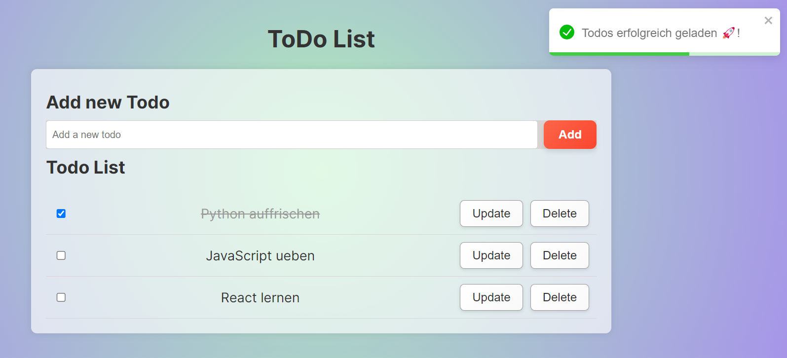

# Full Stack To-Do List Application

This is a **full-stack To-Do list application** developed with **React** for the frontend and **Node.js** for the backend. The application allows users to create, view, edit, and delete tasks efficiently. Additionally, it incorporates **monitoring** with **Prometheus** and **performance testing** with **k6**.

## Table of Contents

- [Technologies](#technologies)
- [Installation](#installation)
- [Testing](#testing)
- [Features](#features)
- [Monitoring](#monitoring)
- [Documentation](#documentation)
- [API Documentation with Swagger](#api-documentation-with-swagger)

## Technologies

- **Frontend**: React
- **Backend**: Node.js, Express
- **Database**: SQLite
- **Testing**:
  - Frontend: Jest
  - Backend: Supertest
  - Load Testing: k6
- **Monitoring**: Prometheus
- **Logging**: Winston
- **User Notifications**: React-Toastify

## Installation

To run the application locally, follow these steps:

1. **Clone the repository**:
   ```bash
   git clone <repository-url>
   cd <repository-directory>
   ```

2. **Install the dependencies for the backend**:
   ```bash
   cd api
   npm install
   ```

3. **Install the dependencies for the frontend**:
   ```bash
   cd ../frontend
   npm install
   ```

4. **Start the backend**:
   ```bash
   cd ../api
   npm start
   ```

5. **Start the frontend**:
   ```bash
   cd ../frontend
   npm start
   ```

## Testing

To run the tests for the frontend, navigate to the frontend directory and execute:
```bash
cd frontend
npm test
```

For the backend, use:
```bash
cd api
npm test
```

### Load Testing

To perform load testing, you can use **k6**. Follow these steps to run the load tests:

1. **Install k6** (if not already installed):
   - Follow the installation instructions from the official [k6 website](https://k6.io/docs/getting-started/installation).

2. **Navigate to the k6 scripts directory and run the test**:
   ```bash
   cd api
   k6 run load_test.js
   ```

## Features

- Create, edit, and delete tasks
- User interface with **Toastify** notifications for a better user experience
- Monitoring with **Prometheus** for performance metrics
- Load testing with **k6** to simulate multiple users and assess performance

## Monitoring

The application includes integration with **Prometheus** for monitoring performance metrics such as:

- API request counts
- Response times
- CPU and memory usage

You can access the metrics by navigating to `http://localhost:5000/metrics` once the backend server is running.

## Documentation

The API documentation is available at the following link: [Postman Documentation](https://documenter.getpostman.com/view/37301523/2sAXxLAZSH#99c3348e-1193-45d2-9e26-11766653c5c9)

## API Documentation with Swagger

The application includes **Swagger** for interactive API documentation. You can access the Swagger UI at the following URL:

```
http://localhost:5000/api-docs
```

This interface allows you to explore the API endpoints, view request/response formats, and test the API directly from the browser.

